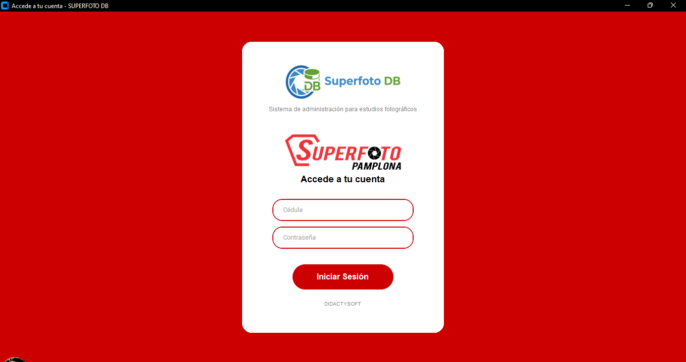
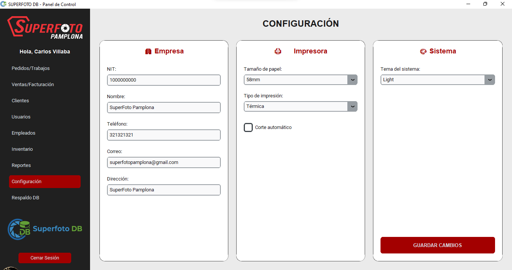
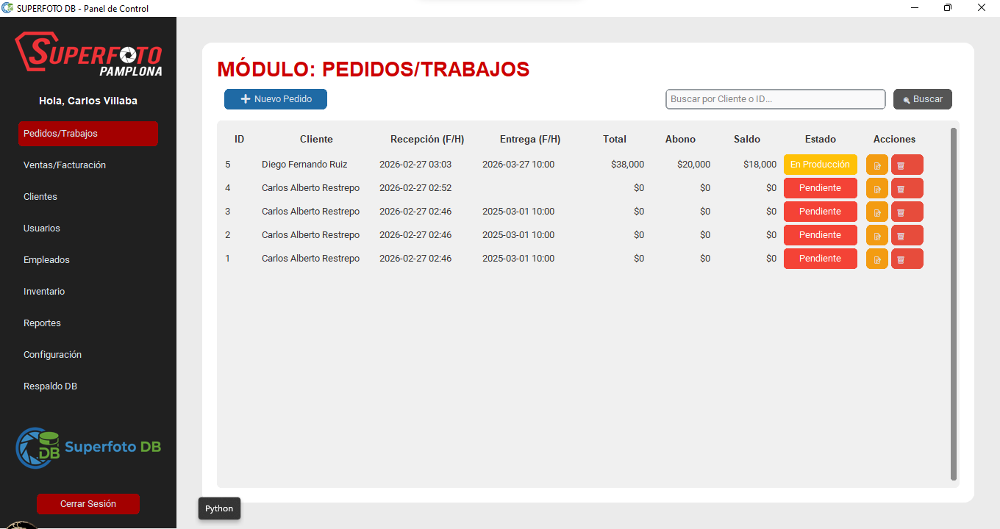

# 📸 SUPERFOTO_DB - Sistema de Gestión de Pedidos


**SUPERFOTO_DB** es una solución integral de escritorio diseñada para la gestión eficiente de estudios fotográficos. Este sistema permite el control total sobre pedidos, clientes y la persistencia de datos mediante una arquitectura organizada y segura.

---

## 🛠️ Tecnologías Utilizadas

- **Lenguaje:** Python 3.12
- **Interfaz Gráfica:** Tkinter / CustomTkinter (Modern UI)
- **Base de Datos:** SQLite3
- **Gestión de Versiones:** Git & GitHub

---

## 📸 Capturas de Pantalla

Para visualizar el funcionamiento del sistema, se presentan las siguientes interfaces principales:

### 1. Control de Acceso (Login)

Interfaz de seguridad para el ingreso de usuarios autorizados.

> 

### 2. Panel Principal (Dashboard)

Centro de control con acceso a todos los módulos del sistema.

> 

### 3. Gestión de Pedidos y Base de Datos

Módulo para el registro, edición y consulta de pedidos en tiempo real.

> 

---

## 🚀 Instalación y Ejecución

Sigue estos pasos para poner en marcha el proyecto en tu máquina local:

1. **Clonar el repositorio:**
   ```bash
   git clone [https://github.com/didactysoft/SUPERFOTO_DB.git](https://github.com/didactysoft/SUPERFOTO_DB.git)
   cd SUPERFOTO_DB
   ```
